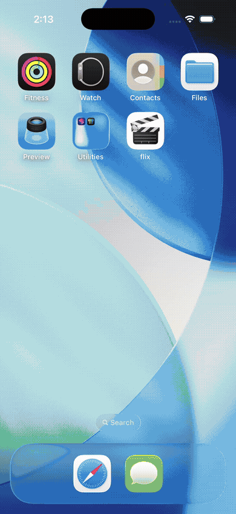

# Flix




> Dual-layout iOS movie browser that presents TMDb's now-playing list as a `UITableView` and a superhero genre grid as a `UICollectionView`, loading all poster images via AlamofireImage's `af_setImage(withURL:)` with built-in memory caching and request deduplication.

## Features

- **`UITableView` list layout:** `NowPlayingViewController` fetches `api.themoviedb.org/3/movie/now_playing` via `URLSession.dataTask`, deserializes the JSON response with `JSONSerialization.jsonObject`, and binds title, overview, and poster to `MovieCell` with a fixed row height of 120pt
- **`UICollectionView` grid layout:** `SuperheroViewController` fetches movies similar to a fixed TMDb movie ID via `/movie/297762/similar` and displays them in `PosterCell` — a bare `UICollectionViewCell` with a single `posterImageView`. Cell width is computed at runtime: `width = collectionView.frame.width / cellsPerLine - interItemSpacingTotal / cellsPerLine` with `layout.itemSize` set to `CGSize(width: width, height: width * 3/2)` for a 2:3 poster aspect ratio
- **AlamofireImage poster loading:** Both `MovieCell` and `PosterCell` call `posterImageView.af_setImage(withURL: posterURL)`, routing through AlamofireImage's `ImageDownloader` which deduplicates in-flight requests for the same URL and caches decoded `UIImage` instances in an `AutoPurgingImageCache`
- **`UIActivityIndicatorView` load state:** `NowPlayingViewController` calls `activityIndicator.startAnimating()` before `fetchMovies()` and `stopAnimating()` in the `URLSession` completion handler
- **Pull-to-refresh on the list:** A `UIRefreshControl` added via `insertSubview(_:at:0)`; its `valueChanged` target calls `fetchMovies()` and `refreshControl.endRefreshing()` inside the data task completion
- **Detail view with backdrop and poster:** `DetailViewController` uses a `MovieKeys` enum of static string constants (`title`, `release_date`, `overview`, `backdrop_path`, `poster_path`) to safely extract values from the `[String: Any]` dictionary, then loads both `backdropImageView` and `posterImageView` with `af_setImage(withURL:)` using the `w500` base URL
- **Segue-based navigation from both layouts:** `NowPlayingViewController.prepare(for:sender:)` casts `sender` to `UITableViewCell` and resolves the index path; `SuperheroViewController.prepare(for:sender:)` casts to `UICollectionViewCell`. Both pass the same `[String: Any]` dictionary to `DetailViewController.movie`
- **`MovieApiManager` service layer:** A separate class holds `baseUrl` and `apiKey` as static constants and owns a `URLSession`, providing a `nowPlayingMovies(completion:)` method that decouples networking from view controllers

## Tech Stack

| Layer | Technology |
|---|---|
| Language | Swift 3 |
| UI | UIKit, UITableView, UICollectionView, UICollectionViewFlowLayout, Auto Layout |
| Image Loading | AlamofireImage 3.3 (`af_setImage(withURL:)`, `AutoPurgingImageCache`) |
| Networking | URLSession (dataTask with JSONSerialization) |
| API | TMDb v3 (`/movie/now_playing`, `/movie/{id}/similar`) |
| Dependencies | CocoaPods |

## Architecture

A `UITabBarController` presents `NowPlayingViewController` (table layout) and `SuperheroViewController` (collection grid layout) as sibling tabs. Both view controllers fetch independently via `URLSession.dataTask` and hold their own `movies: [[String: Any]]` arrays. Tapping any row or cell passes the corresponding dictionary to `DetailViewController` through a storyboard segue. `MovieApiManager` is defined as a reusable service layer but view controllers currently call `URLSession` directly, keeping the networking path straightforward.

## Key Implementation

**`UICollectionViewFlowLayout` sizing at runtime:** `SuperheroViewController.viewDidLoad` casts the layout to `UICollectionViewFlowLayout`, sets `minimumInteritemSpacing` and `minimumLineSpacing` to 5 points, then derives `itemSize` from `collectionView.frame.size.width` to produce exactly three columns regardless of device width — no hardcoded point values.

**`af_setImage` request deduplication:** AlamofireImage's `UIImageView` extension deduplicates requests internally — if two cells request the same poster URL simultaneously, only one HTTP request fires and both image views are updated from a single response. This differs from AFNetworking's `UIImageView+AFNetworking`, which requires explicit serialization per image view.

**`MovieKeys` enum for JSON keys:** `DetailViewController` accesses dictionary values through `MovieKeys.title`, `MovieKeys.backdropPath`, etc. rather than raw string literals, catching key-name typos at compile time.

## Setup

```bash
git clone https://github.com/gerardrecinto/flix-ios.git
cd flix-ios
pod install
open flix.xcworkspace
```

Add your TMDb API key to `NowPlayingViewController.swift`, `SuperheroViewController.swift`, and `MovieApiManager.swift` before building.
